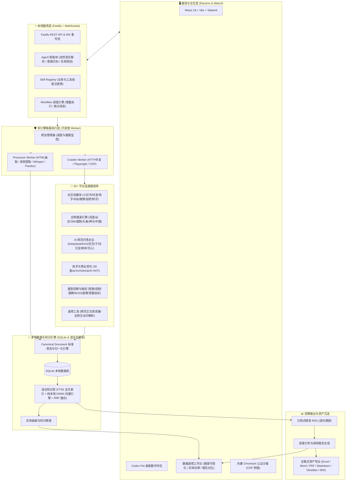

<div align="center">


# UniSearch

**现代化跨平台 AI 自主内容调研与数据采集工作台**

[](LICENSE)
[](https://nodejs.org/)
[](https://www.electronjs.org/)
[](https://www.typescriptlang.org/)
[](https://fastify.dev/)
[](https://react.dev/)
[](#-核心特性)

<p align="center">
<a href="#️-系统架构">系统架构</a> •
<a href="#-核心特性">核心特性</a> •
<a href="#-32-全网信源与-13-大内置技能体系">信源与技能体系</a> •
<a href="#-快速开始">快速开始</a> •
<a href="#-多平台打包与发布">打包与发布</a> •
<a href="#-项目目录结构">项目目录结构</a> •
<a href="#-联系作者与交流">联系作者</a>
</p>

UniSearch 是一款专为研究员、分析师与数据探索者打造的 **AI 驱动跨平台多信源公开内容采集与深度调研桌面工作台**。

通过自然语言提出调研诉求，AI 自主拆解意图、规划采集路径、调度连接器并发抓取、清洗归一并生成结构化洞察报告。

**数据与登录态 100% 本地留存；支持接入任意兼容主流标准的本地或云端大模型。**

</div>

---

## 🏗️ 系统架构

UniSearch 采用 **本地优先（Local-First）** 与 **子进程沙箱隔离** 架构：



### 架构亮点

- **多进程隔离与高容错自愈**：爬虫采集与数据处理独立运行在 Node.js Worker 子进程中，通过 IPC 异步通信，单 Worker 异常自动熔断恢复，保障 UI 始终丝滑流畅。
- **三模混合采集调度网关**：按信源特性智能路由——公开接口走 HTTP 极速并发，动态页面走 Playwright 渲染，风控挑战无缝桥接至内置 Chromium 会话沙箱。
- **Canonical Document V2 标准模型**：对 32+ 平台多源异构数据统一清洗归一，内置内容 Hash 校验、字段置信度门禁与不可变版本快照。
- **本地双轨检索与 RRF 融合**：SQLite FTS5 全文索引与 Transformers.js ONNX 本地向量引擎协同运行，基于倒数排名融合（RRF）实现毫秒级混合召回。
- **Local-First 零信任隐私机制**：所有采集数据、向量索引与登录态 Cookie 100% 留存在本地 SQLite 与沙箱环境，零云端上传，彻底杜绝数据泄露。

---

## ✨ 核心特性

- **🤖 自然语言自主调研与增量迭代**：输入任意研究课题，AI 自主拆解意图、规划采集路径并拓宽关键词；支持增量去重、断点续采与多版本研报对比。
- **🧩 13+ 场景化业务与采集技能**：内置深度研报、品牌 GEO 监测、招聘薪酬分析、学术代码搜索等全场景工作流，支持自然语言、`@` 快捷菜单或 `/` 斜杠指令。
- **🌐 32+ 全网主流公开信源覆盖**：开箱即用覆盖社交自媒体、全网搜索引擎、AI 网页问答、科技资讯与垂直招聘五大领域连接器。
- **📖 证据级引用研报与逐句溯源**：基于本地知识库执行精准 RAG 分析，所有观点与数据结论均严格标注原始命中段落与网页链接，彻底告别 AI 幻觉。
- **🕸️ 实体治理与交互式知识图谱**：自动抽取公司、品牌、人物及竞品等实体，支持实体一键归并、多义拆分与力导向拓扑关系穿透下钻。
- **📊 多维数据透视与全格式资产沉淀**：按平台、发布时间、作者及互动量灵活筛选聚合，一键导出 Excel、Word、PDF、Markdown、Obsidian 知识库及 IMA。
- **🐾 Codex Pet 桌面伴侣与状态联动**：内置桌面数字伴侣实时联动 Agent 执行状态与采集进度，兼具运行健康监控与桌面陪伴体验。

---

## 🌐 32+ 全网信源与 13 大内置技能体系

UniSearch 构建了从「底层多平台数据接入」到「上层场景化业务编排」的完整闭环体系：

### 🔌 32+ 平台连接器矩阵（底层数据采集驱动）

内置 **32 个开箱即用的专业连接器**，覆盖全网主流公开信源：

- 📱 **社交自媒体 (7)**：小红书、抖音、快手、哔哩哔哩、微博、知乎、百度贴吧
- 🔍 **全网搜索引擎 (7)**：百度、必应、360、搜狗、头条、神马、中国搜索
- 🤖 **AI 网页问答 (7)**：DeepSeek、Kimi、豆包、通义千问、腾讯元宝、纳米 AI、文心一言
- 📰 **技术与商业资讯 (4)**：36氪、arXiv 论文、GitHub 热门、AI HOT 热点
- 💼 **招聘与维权 (5)**：智联招聘、前程无忧、猎聘、BOSS 直聘、黑猫投诉
- 🛠️ **通用解析工具 (2)**：通用网页正文阅读器、30+ 平台综合无水印音视频解析

### 🎯 13+ 场景化业务技能（上层 AI 任务编排）

内置 **13 个专业业务与采集技能**，支持自然语言驱动、输入框键入 `@` 呼出或 `/` 斜杠指令调度：

- 💼 **业务研报技能**：新媒体内容深度调研、品牌 GEO 呈现与舆情监测、招聘与行业薪酬测算
- 🛠️ **场景采集技能**：全网网页/社媒/AI问答/岗位垂直搜索、学术与代码检索、创作者主页批量采集
- ⚙️ **工具与数据管道**：全网 30+ 平台无水印解析、跨源数据 Canonical 归一化、音视频转知识库

> 👉 详细调用参数、接口覆盖与执行链路请参阅：[**32 个连接器完整矩阵**](docs/connectors-matrix.md) • [**13 大技能体系全景指南**](docs/skills-matrix.md) • [**业务技能 Manifest 规范**](docs/business-skills/)


---

## 🚀 快速开始

### 📋 环境要求

- **Node.js** >= `22.12.0` ([Node.js 官方下载](https://nodejs.org/))
- **npm** >= `10.0.0`
- **操作系统**：macOS (Apple Silicon / Intel) 或 Windows 10/11 (x64)

### 📦 安装依赖与模型准备

```bash
# 1. 克隆项目仓库
git clone https://github.com/ucmao/unisearch.git
cd unisearch

# 2. 安装后端与前端依赖（会自动通过 postinstall 拉取内置本地向量模型）
npm install
npm --prefix webui install

# 3. （可选）手动检查或重新拉取本地向量模型文件
npm run setup:models
```

### 🖥️ 启动开发模式

```bash
# 构建 WebUI 前端与后端
npm run webui:build && npm run build:backend

# 启动 Electron 桌面应用
npm run electron:dev
```

### ⚙️ 模型与检索配置指南

进入应用后点击右上角 **「设置」**：
1. **大语言模型（LLM）**：配置用于意图拆解与报告撰写的大模型 API（支持 MiniMax、DeepSeek、OpenAI、Ollama 或任何兼容接口）。
2. **知识库检索引擎（Retrieval）**：
   - **纯本地向量模型 (ONNX)（默认推荐）**：无需任何 API Key，使用内置本地模型，零网络请求、零费用，毫秒级向量语义召回。
   - **硅基流动 (SiliconFlow)**：云端高维 Embedding（如 `BAAI/bge-m3`）与重排模型（如 `bge-reranker-v2-m3`）。
   - **自定义兼容接口 (Custom)**：接入私有部署或第三方 OpenAI 兼容的 Embedding / Reranker 端点。

### 🧪 测试与代码规范

```bash
# 运行 Agent 核心测试套件
npm run test:agent

# 代码质量检查
npm run lint

# 自动修复格式问题
npm run lint:fix
```

---

## 📦 多平台打包与发布

完整的本地构建、平台专属正式发布（macOS / Windows）、签名公证与安装包校验规范，请参阅：

👉 **[桌面端发布与打包指南](docs/release-packaging.md)**

---


## 📂 项目目录结构

```text
unisearch/
├── api/                   # 本地 WebUI 静态托管目录
├── build/                 # 应用图标 (icns / ico / png) 与构建资源
├── data/                  # 本地运行时 SQLite 数据库与缓存
├── docs/                  # 详细架构设计、连接器矩阵与技能体系规范文档
├── resources/             # 打包外置依赖与静态资源
│   └── models/            # 内置纯本地 ONNX 向量嵌入模型 (bge-small-zh-v1.5)
├── scripts/               # 模型下载、发布校验、环境检测与冒烟测试脚本
├── src/                   # 后端主进程与核心服务源码 (TypeScript)
│   ├── analyzers/         # 深度调研报告生成、图谱与数据分析器
│   ├── connectors/        # 32+ 平台连接器 Manifests、Registry、健康检查
│   ├── core/              # 核心配置、日志系统、类型定义与错误处理
│   ├── crawler/           # 爬虫管理器与 Crawler Worker (Playwright / HTTP / CDP)
│   ├── database/          # SQLite 数据库模型、Migrations 与 Repositories
│   ├── document/          # 标准文档引擎与清洗归一化
│   ├── exporters/         # Excel / Word / PDF / Markdown / JSON / CSV 等导出器
│   ├── knowledge/         # 本地 ONNX 向量引擎 (Transformers.js)、FTS5 检索与 RAG
│   ├── main/              # Electron 主进程、窗口管理、托盘与 IPC 通信
│   ├── processor/         # Processor Worker 子进程数据处理流水线
│   ├── server/            # Fastify HTTP 服务、REST API 与 WebSocket 推送
│   ├── services/          # Agent 服务、工作流调度、认证与资产管理
│   ├── skills/            # 业务与工具技能注册表、执行编排与 Prompt 规范
│   ├── tools/             # AI Agent 可调用的底层工具集
│   └── workflow/          # 工作流引擎、DAG 调度器与增量执行状态机
├── tests/                 # 单元测试与 Agent 评估测试
└── webui/                 # 前端桌面 UI 源码 (React 18 + Vite + Tailwind)
    └── src/
        ├── components/
        │   ├── agent/     # 智能对话工作区、任务规划器与 Codex Pet 伴侣
        │   ├── analytics/ # 数据透视工作台、知识图谱与报告对比
        │   ├── config/    # 模型与连接器配置面板
        │   ├── console/   # 执行终端与运行日志
        │   ├── crawler/   # 采集进度与认证弹窗
        │   ├── data/      # 数据浏览与多格式导出
        │   ├── env/       # 环境检测与依赖安装
        │   └── layout/    # 顶部导航、侧边栏与设置弹窗
        ├── hooks/         # 状态与网络请求 Custom Hooks
        ├── store/         # 全局状态管理
        └── types/         # 前端 TypeScript 类型定义
```

---

## 📬 联系作者与交流

如果您在开发、使用或接入过程中遇到任何问题，欢迎通过以下渠道交流与反馈：

- **微信**：`csdnxr`
- **QQ**：`294323976`
- **邮箱**：[leoucmao@gmail.com](mailto:leoucmao@gmail.com)
- **Bug 报告与需求建议**：欢迎在 GitHub 提交 [Issues](https://github.com/ucmao/unisearch/issues)

---

## 📄 开源协议与免责声明

本项目遵循 [MIT License](LICENSE) 协议开源。

**免责声明：**
1. 本项目仅供个人技术研究、学术探讨与学习交流使用，严禁用于任何商业牟利、非法抓取或侵犯他人权益的场景。
2. 使用本项目时，请严格遵守所在国家/地区的法律法规及各目标平台的服务条款（ToS）与 Robots 协议。因不当使用产生的任何法律责任或纠纷，均由使用者自行承担，与本项目开发者无关。
