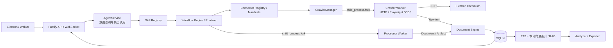

<div align="center">


# UniSearch

**基于 Electron + TypeScript 的多平台 AI 内容调研与采集工具**

[](LICENSE) [](https://nodejs.org/) [](https://www.electronjs.org/) [](#-支持的采集平台与信源)

<p align="center">
<a href="#-系统架构">系统架构</a> •
<a href="#-核心功能">核心功能</a> •
<a href="#-支持的采集平台与信源">采集平台与信源</a> •
<a href="#-快速开始">快速开始</a> •
<a href="#-应用打包">应用打包</a> •
<a href="#-联系作者">联系作者</a>
</p>

UniSearch 是一款基于 AI 的**多平台公开内容采集与调研桌面工具**。

通过自然语言描述调研目标，由 AI 自动规划任务流程，并发调度底层连接器进行公开数据采集与清洗。

**采集结果与登录态保存在本地；AI 规划与分析可接入配置的模型 API。**

</div>

---

## 🏗️ 系统架构

UniSearch 的主链路为 **Agent 规划 -> Skill / Workflow 编排 -> Connector / Processor 隔离执行 -> 知识处理与导出**：



### 核心架构说明

- **Agent**：将自然语言解析为平台、关键词、采集深度和分析目标。
- **Skill / Workflow**：Skill 定义可复用任务模板，Workflow 统一调度采集、处理、索引、分析与导出。
- **Connector / Worker**：Connector 统一平台能力与参数；采集和文档处理分别在 Crawler Worker、Processor Worker 子进程执行。
- **数据与知识**：RawItem 归一化为 Document 后存入 SQLite，支持混合检索、引用式 RAG、分析和多格式导出。

---

## 💎 核心功能

* **AI 智能任务规划**：从自然语言生成平台、关键词、采集深度与分析目标。
* **多模式采集**：通过 HTTP、Playwright 与 CDP 提取公开内容、详情及评论。
* **多平台并行执行**：支持主流社交、搜索引擎、AI 问答等多平台并行采集，并提供实时日志与进度监控。
* **本地知识库**：统一存入 SQLite，支持检索、RAG、分析及多格式导出。
* **独立安全登录**：支持二维码及 Cookie 本地缓存登录，遇验证码可在内置浏览器中手动处理。

## ✨ 项目特点

* **本地优先**：后端、数据库、知识索引与登录态均在本机运行或保存。
* **高效易用**：内置 Electron 桌面可视化界面，前后端解耦设计，响应快速流畅。
* **AI 大模型兼容**：支持 DeepSeek、MiniMax 及标准 OpenAI 兼容接口。

---

## 💾 支持的采集平台与信源

| 类别 | 平台与信源 |
| :--- | :--- |
| **社交与内容平台** | 小红书、抖音、快手、哔哩哔哩、微博、百度贴吧、知乎 |
| **搜索引擎** | 百度搜索、必应搜索、360搜索、搜狗搜索、头条搜索 |
| **AI 网页问答** | DeepSeek、Kimi、豆包、通义千问、腾讯元宝、纳米AI、文心一言 |
| **技术、论文与资讯** | arXiv、GitHub 仓库、RSS 新闻、AI HOT |
| **垂直平台** | 智联招聘、前程无忧、猎聘网、BOSS直聘、黑猫投诉 |
| **通用工具** | 通用网页阅读器、综合无水印解析 |

---

## 🚀 快速开始

### 📋 前置要求

* **Node.js** >= 22.12.0 ([下载地址](https://nodejs.org/))

### 📦 安装依赖

```bash
# 安装根项目及 WebUI 依赖
npm install
npm --prefix webui install
```

### 🖥️ 启动开发模式

```bash
# 首次运行或前端更新后需构建 WebUI
npm run webui:build

# 编译后端并启动 Electron 桌面应用
npm run electron:dev
```

> **提示**：AI 规划与分析功能需在应用「设置」中配置 MiniMax、DeepSeek 或 OpenAI 兼容接口 Key。

### 🛠️ 前后端分离调试（可选）

如需单独调试前端 UI 界面：

1. **启动后端服务与 Electron 容器**：
   ```bash
   npm run electron:dev
   ```
2. **启动前端 Vite 开发服务**（在另一个终端窗口）：
   ```bash
   npm --prefix webui run dev
   ```
   在浏览器访问 `http://localhost:5173/` 即可。

### 🧪 测试与代码检查（可选）

```bash
# 运行核心测试套件
npm run test:agent

# 代码风格与规范检查
npm run lint
```

---

## 📦 应用打包

### 1. 基础打包命令

执行以下命令自动构建后端、WebUI 并打包为当前系统平台的安装包：

```bash
# 构建后端、WebUI 并打包生成安装包
npm run electron:build
```

打包完成后，安装包产物将自动输出至 `dist/` 目录。

### 2. 平台专属发布命令

```bash
# Windows 平台正式发布构建（需在 Windows 机器执行）
npm run electron:build:win:release

# macOS 平台正式发布构建（需在 macOS 机器执行，支持签名与公证检查）
npm run electron:build:mac:release
```

### ⚠️ Windows 打包提示

Windows 打包需要符号链接权限（用于解压工具包与注入图标），请满足以下任一条件后再执行打包：
- **开启开发者模式**（推荐）：系统设置 -> 开发者选项 -> 开启「开发人员模式」；
- **管理员身份运行**：以管理员身份打开 CMD / PowerShell 终端执行打包命令。

> 详细的发布打包流程、代码签名及产物校验规范请参阅 [docs/release-packaging.md](docs/release-packaging.md)。

---

## 📬 联系作者

如果您在开发或使用过程中遇到任何问题，欢迎通过以下方式联系：

- **微信**：`csdnxr`
- **QQ**：`294323976`
- **邮箱**：[leoucmao@gmail.com](mailto:leoucmao@gmail.com)
- **Bug 反馈**：欢迎在项目 GitHub 提交 [Issues](https://github.com/ucmao/unisearch/issues)

---

## 📄 开源协议与免责声明

本项目基于 [MIT License](LICENSE) 协议开源。

**免责声明：**
1. 本项目仅供技术学习、研究与交流使用，请勿用于任何非法用途。
2. 请在遵守相关法律法规及各目标平台使用条款的前提下合理使用本工具，因违反平台条款或法律法规产生的任何责任与本项目作者无关。
