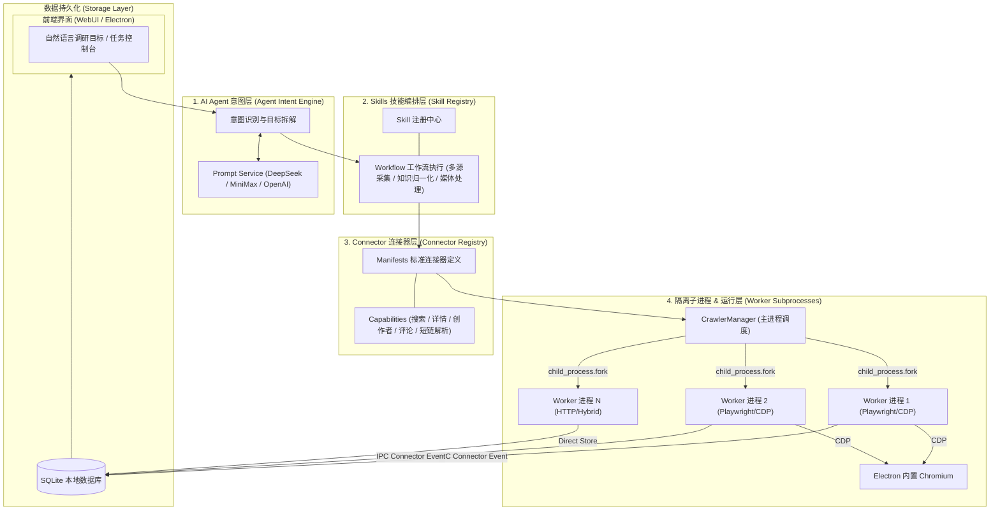

<div align="center">


# UniSearch

**基于 Electron + TypeScript 的多平台 AI 内容调研与采集工具**

[](LICENSE) [](https://nodejs.org/) [](https://www.electronjs.org/) [](#-支持的平台矩阵)

<p align="center">
<a href="#-系统架构">系统架构</a> •
<a href="#-核心功能">核心功能</a> •
<a href="#-支持的平台矩阵">平台矩阵</a> •
<a href="#-快速开始">快速开始</a> •
<a href="#-应用打包">应用打包</a>
</p>

UniSearch 是一款基于 AI 的**多平台公开内容采集与调研桌面工具**。

通过自然语言描述调研目标，由 AI 自动规划任务流程，并发调度底层连接器进行公开数据采集与清洗。

**数据全部存储在本地 SQLite 数据库中，无需第三方服务中转，独立高效可控。**

</div>

---

## 🏗️ 系统架构

UniSearch 采用了 **AI Agent 意图解构 -> Skill 技能编排 -> Connector 标准连接器 -> 隔离子进程执行** 的四层分级架构：



### 核心架构说明

- **Agent 意图层 (Agent Intent Engine)**：将用户的自然语言目标解析为结构化调研计划，自动匹配平台、关键词、采集深度与分析维度。
- **Skills 技能层 (Skill Registry)**：提供跨平台多源调研（`multi-source-research`）、媒体转知识库（`media-to-knowledge`）等高度抽象的工作流组合能力。
- **Connector 连接器层 (Connector Manifests)**：统一各平台的输入参数、输出 Schema、预算模型及认证交互，实现平台能力的解耦扩展。
- **子进程隔离运行 (Worker Subprocess)**：每个 Connector 运行在独立的 Node.js 子进程中（`child_process.fork`），基于 Playwright/CDP 或 HTTP 独立抓取，子进程崩溃不影响 Electron 主进程，并通过 IPC 向 SQLite 实时流式入库。

---

## 💎 核心功能

* **AI 智能任务规划**：支持自然语言描述调研目标，由 AI 自动规划检索平台、关键词及分析维度，执行前自由确认与调整。
* **原生自动化采集**：基于 Playwright 与 CDP 浏览器自动化技术，高效提取平台公开内容、详情及评论数据。
* **多平台并行执行**：支持主流社交、搜索引擎、AI 问答等多平台并行采集，并提供实时日志与进度监控。
* **本地数据持久化**：数据统一保存至本地 SQLite 数据库，支持灵活搜索、多维筛选与 CSV 导出。
* **独立安全登录**：支持二维码及 Cookie 本地缓存登录，遇验证码可在内置浏览器中手动处理。

## ✨ 项目特点

* **纯本地架构**：无需配置复杂外部后端服务，数据与登录态完全保存在本地磁盘。
* **高效易用**：内置 Electron 桌面可视化界面，前后端解耦设计，响应快速流畅。
* **AI 大模型兼容**：支持 DeepSeek、MiniMax 及标准 OpenAI 兼容接口。

---

## 💾 支持的平台矩阵

### 1. 社交与内容平台
| 平台名称 | 关键词搜索 | 内容详情 | 创作者主页 | 评论与回复 | 分享短链解析 | 登录态缓存 |
| :--- | :---: | :---: | :---: | :---: | :---: | :---: |
| **小红书** | ✓ | ✓ | ✓ | ✓ | ✓ | ✓ |
| **抖音** | ✓ | ✓ | ✓ | ✓ | ✓ | ✓ |
| **快手** | ✓ | ✓ | ✓ | ✓ | ✓ | ✓ |
| **哔哩哔哩** | ✓ | ✓ | ✓ | ✓ | ✓ | ✓ |
| **新浪微博** | ✓ | ✓ | ✓ | ✓ | ✓ | ✓ |
| **百度贴吧** | ✓ | ✓ | ✓ | ✓ | ✓ | ✓ |
| **知乎** | ✓ | ✓ | ✓ | ✓ | ✓ | ✓ |

### 2. 全网搜索引擎
| 平台名称 | 全网关键词搜索 | 分页采集 | SERP 摘要提取 | 免登录运行 |
| :--- | :---: | :---: | :---: | :---: |
| **百度搜索** | ✓ | ✓ | ✓ | ✓ |
| **必应中国** | ✓ | ✓ | ✓ | ✓ |
| **360 搜索** | ✓ | ✓ | ✓ | ✓ |
| **搜狗搜索** | ✓ | ✓ | ✓ | ✓ |
| **头条搜索** | ✓ | ✓ | ✓ | ✓ |

### 3. AI 网页问答与深度思考
| 平台名称 | 模拟提问与搜索 | 深度思考过程抓取 | 参考资料/新闻引用 | 免登录 / Cookie 缓存 |
| :--- | :---: | :---: | :---: | :---: |
| **DeepSeek** | ✓ | ✓ | ✓ | ✓ |
| **Kimi (月之暗面)** | ✓ | ✓ | ✓ | ✓ |
| **豆包** | ✓ | ✓ | ✓ | ✓ |
| **通义千问** | ✓ | ✓ | ✓ | ✓ |
| **腾讯元宝** | ✓ | ✓ | ✓ | ✓ |
| **纳米 AI** | ✓ | ✓ | ✓ | ✓ |
| **文心一言** | ✓ | ✓ | ✓ | ✓ |

### 4. 垂直领域平台
| 平台名称 | 分类类别 | 关键词搜索 | 详情 JD / 投诉节点解析 | 风控人工验证 |
| :--- | :--- | :---: | :---: | :---: |
| **智联招聘** | 招聘岗位搜索与 JD 解析 | ✓ | ✓ | ✓ |
| **黑猫投诉** | 消费维权事件与单据 | ✓ | ✓ | ✓ |

### 5. 实用解析工具
| 工具名称 | 支持平台数量 | 功能说明 | 免登录运行 |
| :--- | :--- | :--- | :---: |
| **综合无水印解析** | **30+** 平台 (含小红书、抖音、快手、可灵、B站、好看视频、梨视频、皮皮搞笑、微视、腾讯视频号、微博、知乎、西瓜视频、A站、最右、皮皮虾、逗拍、全民K歌、汽水音乐、网易云音乐、QQ音乐、绿洲、新片场、美拍、虎牙、豆包、Soul、千问、即梦、剪映、今日头条、闲鱼等) | 输入作品链接或分享短链，自动解析提取无水印原画视频、高清原图集、音频与元数据。 | ✓ |

---

## 🚀 快速开始

### 📋 前置要求

* **Node.js** >= 20.0.0 ([下载地址](https://nodejs.org/))

### 📦 安装依赖

```bash
# 安装根项目及 WebUI 依赖
npm install
npm --prefix webui install
```

### 🖥️ 启动开发模式

```bash
# 启动 Electron 桌面应用 (自动编译后端并运行)
npm run electron:dev
```

### 🛠️ 前后端分离调试（可选）

如需单独调试前端 UI 界面：

1. **启动后端服务**：
   ```bash
   npm run electron:dev
   ```
2. **启动前端 Vite 开发服务**（在另一个终端窗口）：
   ```bash
   cd webui
   npm run dev
   ```
   在浏览器访问 `http://localhost:5173/` 即可。

---

## 📦 应用打包

执行以下命令将项目打包为跨平台桌面可执行程序（.dmg / .exe）：

```bash
# 构建后端、WebUI 并打包
npm run electron:build
```

打包完成后，产物将自动输出至 `dist/` 目录。
