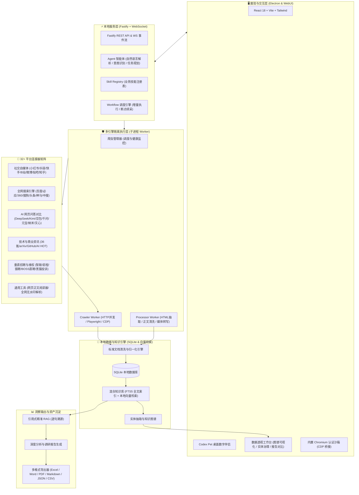

<div align="center">


# UniSearch

**现代化跨平台 AI 自主内容调研与数据采集工作台**

[](LICENSE)
[](https://nodejs.org/)
[](https://www.electronjs.org/)
[](https://www.typescriptlang.org/)
[](https://fastify.dev/)
[](https://react.dev/)
[](#-核心特性)

<p align="center">
<a href="#-系统架构">系统架构</a> •
<a href="#-核心特性">核心特性</a> •
<a href="#-支持的采集平台与信源全景">采集平台与信源</a> •
<a href="#-内置业务技能预设">内置业务技能</a> •
<a href="#-快速开始">快速开始</a> •
<a href="#-多平台打包与发布">打包与发布</a> •
<a href="#-项目目录结构">项目结构</a> •
<a href="#-联系作者">联系作者</a>
</p>

UniSearch 是一款专为研究员、分析师与数据探索者打造的 **AI 驱动跨平台多信源公开内容采集与深度调研桌面工作台**。

通过自然语言提出调研诉求，AI 自主拆解意图、规划采集路径、调度连接器并发抓取、清洗归一并生成结构化洞察报告。

**数据与登录态 100% 本地留存；支持接入任意兼容主流标准的本地或云端大模型。**

</div>

---

## 🏗️ 系统架构

UniSearch 采用 **本地优先（Local-First）** 与 **子进程沙箱隔离** 架构：



### 架构亮点

- **子进程沙箱隔离**：采集与数据处理独立在 Node.js 子进程中运行，避免 UI 卡顿，单 Worker 异常自动恢复。
- **混合多引擎调度**：免认证接口走 HTTP 高并发，复杂动态页面走 Playwright，风控挑战自动无缝桥接至内置 Chromium。
- **统一标准化文档**：多源异构数据统一归一化为标准文档结构，包含标题、正文、作者、发布时间、多媒体及互动指标。
- **本地优先与隐私安全**：采集数据、知识索引与登录态 Cookie 均保存在本地 SQLite 与沙箱目录，不上传第三方服务器。

---

## 💎 核心特性

### 🤖 AI 自主任务规划与增量调度
- **自然语言驱动**：输入调研课题或业务目标，AI 自动完成平台选型、关键词拓展、采集深度预算与分析维度规划。
- **指令路由与快捷操作**：支持斜杠指令快速调用内置技能，支持按平台或步骤选择性执行工作流。
- **增量执行与断点续采**：支持多轮增量迭代采集，自动去重，任务中断可无缝续跑。

### 🌐 32+ 平台连接器全矩阵
- 覆盖 **社交自媒体、全网搜索引擎、AI 网页问答、技术与商业资讯、垂直招聘、消费维权、通用网页提取与无水印解析**。
- 统一参数校验与质量门禁，实时输出执行日志、采集进度与连接器健康状态。

### 🧠 本地混合知识库与引用式精准 RAG
- **混合检索召回**：结合 SQLite FTS5 全文检索与本地语义向量检索，兼顾精准关键词匹配与语义相关度。
- **逐句证据溯源**：AI 回答与分析报告中的关键事实与数据均精确标注原始出处、平台链接与命中段落。

### 🕸️ 实体治理与知识图谱
- **自动实体抽取**：从海量文本中自动抽取公司、品牌、人物、产品、技能与赛道等核心实体。
- **交互式实体治理**：支持相似实体一键归并、多义实体拆分与别名维护，内置力导向拓扑关系图与演化动画。

### 📊 多维数据透视工作台
- **多维透视与筛选**：支持按平台、发布时间、作者、互动量、关键词及轮次进行灵活过滤与聚合统计。
- **报告版本对比**：多次生成的研报支持并排比对差异，快速追踪舆情演进与观点变化。
- **一键多格式导出**：支持导出为 **Excel、Word、PDF、Markdown、JSON、CSV、Obsidian、IMA** 等格式。

### 🐾 交互式桌面数字伴侣
- 内置 Codex Pet 桌面数字宠物，支持多种个性化形象切换。
- 具备待机、思考、采集、分析、告警等动态交互动画，实时联动任务运行状态。

### 🔒 独立安全登录与防风控体系
- **内置安全认证浏览器**：无需手动导出 Cookie，直接在内置隔离浏览器中扫码登录，自动持久化会话。
- **人机挑战可视化交互**：遇到验证码挑战时自动弹出交互窗口，用户验证完成后无缝继续执行。
- **大模型生态兼容**：支持 DeepSeek、MiniMax 以及任何兼容 OpenAI 接口标准的本地与云端大语言模型。

---

## 💾 支持的采集平台与信源全景

UniSearch 内置 **32 个开箱即用的专业连接器**：

| 分类 | 平台 / 信源 | 核心能力与采集维度 | 运行引擎 | 认证需求 |
| :--- | :--- | :--- | :--- | :--- |
| **社交与内容平台** | **小红书** | 关键词搜索、笔记详情、图文/视频、创作者主页、评论与楼中楼回复、分享短链解析 | Playwright / CDP | 扫码登录 (持久化) |
| | **抖音** | 关键词搜索、视频/图文详情、创作者主页、评论与回复、无水印音视频解析 | Playwright / CDP | 扫码登录 (持久化) |
| | **快手** | 关键词搜索、短视频详情、播放量/点赞、创作者主页、评论采集 | Playwright / CDP | 扫码登录 (持久化) |
| | **哔哩哔哩** | 视频/专栏搜索、播放/弹幕/投币数据、UP主主页、视频评论与楼中楼 | Playwright / CDP | 扫码登录 (持久化) |
| | **微博** | 关键词博文搜索、转发/点赞数据、用户主页、博文详情与评论 | Playwright / CDP | 扫码登录 (持久化) |
| | **百度贴吧** | 贴吧/主题帖搜索、楼层回复抓取、主页内容采集、帖子详情解析 | Playwright / CDP | 扫码登录 (持久化) |
| | **知乎** | 问题/回答/专栏搜索、高赞回答详情、作者主页、回答评论与回复 | Playwright / CDP | 扫码登录 (持久化) |
| **全网搜索引擎** | **百度搜索** | 全网网页搜索、SERP 排名、标题/摘要提取、真实链接还原、分页采集 | HTTP 极速并发 | 免登录 |
| | **必应搜索** | 国际/国内网页搜索、高质量结果摘要、真实落地页提取、分页采集 | Hybrid 混合引擎 | 免登录 |
| | **360搜索** | 中文网页全网搜索、结果排名与摘要提取、多页并发采集 | HTTP 极速并发 | 免登录 |
| | **搜狗搜索** | 搜狗网页搜索、微信相关结果发现、摘要与原始链接提取 | HTTP 极速并发 | 免登录 |
| | **头条搜索** | 今日头条全网搜索、资讯与动态聚合检索、分页采集 | Hybrid 混合引擎 | 免登录 |
| | **神马搜索** | 移动端视角搜索结果采集、即时网页摘要提取 | Hybrid 混合引擎 | 免登录 (遇挑战可人机交互) |
| | **中国搜索** | 权威官方与新闻类信源定向检索、网页结果提取 | Hybrid 混合引擎 | 免登录 |
| **AI 网页问答对比** | **DeepSeek** | 网页端智能问答模拟、深度思考链（Reasoning）提取、联网参考资料抓取 | Playwright | 免登录 / 账号会话 |
| | **Kimi** | 长文本问答模拟、联网实时搜索资料引用源提取 | Playwright | 免登录 / 账号会话 |
| | **豆包** | 字节跳动 AI 问答交互、参考来源与回答正文采集 | Playwright | 免登录 / 账号会话 |
| | **通义千问** | 阿里千问问答模拟、结构化观点与参考依据提取 | Playwright | 免登录 / 账号会话 |
| | **腾讯元宝** | 腾讯元宝 AI 搜索问答、微信生态参考信源解析 | Playwright | 免登录 / 账号会话 |
| | **纳米AI** | 纳米搜索问答对比、学术与权威资料引用采集 | Playwright | 免登录 / 账号会话 |
| | **文心一言** | 百度文心问答交互、联网参考资料与思考逻辑提取 | Playwright | 免登录 / 账号会话 |
| **技术与商业资讯** | **36氪** | 商业创投资讯关键词搜索、行业特稿与深度文章正文解析 | HTTP API | 免登录 |
| | **arXiv** | 官方 Atom API 论文检索（标题/作者/摘要/分类/DOI/PDF链接） | HTTP API | 免登录 (官方公开) |
| | **GitHub仓库** | 热门开源仓库检索、Stars/Forks 趋势、Readme 与仓库元数据提取 | HTTP API | 免登录 |
| | **AI HOT** | 汇聚全网 AI 资讯、突发热点、大模型动态与科技资讯 | HTTP API | 免登录 |
| **垂直招聘平台** | **智联招聘** | 岗位关键词搜索、城市/薪资/学历/经验过滤、详细 JD 描述与发布时间 | Playwright | 免登录 / 账号会话 |
| | **前程无忧** | 岗位列表检索、薪资范围与公司信息解析、职位 JD 正文抓取 | Playwright | 免登录 / 账号会话 |
| | **猎聘网** | 中高端职位搜索、薪酬福利与技能要求提取、JD 深度解析 | Playwright | 免登录 / 账号会话 |
| | **BOSS直聘** | 岗位与公司详情检索、技能/福利标签、融资阶段与团队规模解析 | Playwright / CDP | 免登录 (支持授权合规采集) |
| **消费维权与风险** | **黑猫投诉** | 维权投诉事件搜索、投诉诉求/涉诉金额、处理状态、商家回复与进度 | Playwright | 免登录 (公开数据) |
| **通用工具与解析** | **通用网页阅读器** | 任意 HTTP/HTTPS 网页正文抽取、标题/作者/时间/图片/富文本清洗 | Hybrid 混合引擎 | 免登录 |
| | **综合无水印解析** | 支持主流 30+ 视频/图集平台的无水印原画高清视频、图集、音频解析 | HTTP API | 免登录 |

---

## 🎯 内置业务技能预设

UniSearch 内置面向商业与研究场景的高级业务技能：

| 技能标识 | 技能名称 | 典型应用场景 | 预设信源组合 |
| :--- | :--- | :--- | :--- |
| `sales-course-intelligence` | **销售课程竞争情报** | 培训与考证赛道竞品价格策略、营销钩子、客户顾虑挖掘与销售话术应答 | 小红书、抖音、知乎、百度、必应 |
| `marketing-content-research` | **新媒体内容调研** | 爆款选题发现、对标账号拆解、高赞表达方式提取、用户痛点与评论诉求洞察 | 小红书、抖音、哔哩哔哩 |
| `brand-geo-risk-monitor` | **品牌GEO与风险监测** | 品牌在主流 AI 模型问答中的可见性与一致性评测，结合黑猫投诉舆情风险预警 | 7大 AI 问答平台 + 黑猫投诉 |
| `hr-salary-benchmark` | **招聘岗位薪酬调研** | 行业薪资水位基准线测算、城市与经验梯队差异、任职资格要求与招聘定价参考 | 智联招聘、前程无忧、猎聘、BOSS直聘 |
| `web-search-research` | **网页聚合全网搜索** | 聚合主流搜索引擎，支持多关键词并行检索、深度翻页与全文正文自动阅读 | 百度、必应、360、搜狗、头条、神马、中搜 |
| `creator-profile-collection` | **创作者主页全量采集** | 指定博主/创作者主页批量作品采集、互动数据复盘与评论回帖跟踪 | 7大主流社交内容平台 |
| `web-media-parser` | **全网综合无水印解析** | 批量解析社交与媒体平台分享链接，无损提取高清视频、图片与音轨 | 30+ 音视频与图文平台 |

---

## 🚀 快速开始

### 📋 环境要求

- **Node.js** >= `22.12.0` ([Node.js 官方下载](https://nodejs.org/))
- **npm** >= `10.0.0`
- **操作系统**：macOS (Apple Silicon / Intel) 或 Windows 10/11 (x64)

### 📦 安装依赖

```bash
# 1. 克隆项目仓库
git clone https://github.com/ucmao/unisearch.git
cd unisearch/unisearch

# 2. 安装后端与前端依赖
npm install
npm --prefix webui install
```

### 🖥️ 启动开发模式

```bash
# 构建 WebUI 前端
npm run webui:build

# 启动 Electron 桌面应用
npm run electron:dev
```

> **🔑 模型配置提示**：首次进入应用后，请在「设置」中配置大模型 API 凭据（支持 MiniMax、DeepSeek、OpenAI 或任何兼容 API）。

### 🛠️ 前后端分离调试（可选）

对前端 React 组件进行热更新调试：

1. **终端 1（启动后端与 Electron）**：
   ```bash
   npm run electron:dev
   ```
2. **终端 2（启动前端 Vite 开发服务器）**：
   ```bash
   npm --prefix webui run dev
   ```
   浏览器访问 `http://localhost:5173/` 即可。

### 🧪 测试与代码规范

```bash
# 运行 Agent 核心测试套件
npm run test:agent

# 代码质量检查
npm run lint

# 自动修复格式问题
npm run lint:fix
```

---

## 📦 多平台打包与发布

### 1. 本地快速构建

自动完成前后端编译并生成当前系统的安装包：

```bash
npm run electron:build
```
打包产物输出至 `dist/` 目录（macOS 为 `.dmg`，Windows 为 `.exe`）。

### 2. 平台专属正式发布构建

正式发布包含签名、公证与防篡改检查：

```bash
# 🍎 macOS 正式发布构建（生成 arm64 DMG，执行 Hardened Runtime 签名、Apple 公证与票据装订）
npm run electron:build:mac:release

# 🪟 Windows 正式发布构建（生成 x64 安装包，执行 Authenticode 代码签名与资源注入）
npm run electron:build:win:release
```

### 3. 安装包校验与冒烟测试

```bash
# 校验解包后的 worker、原生依赖和静态资源
npm run verify:package -- <解包后的平台目录>

# 执行自动化冒烟测试（验证 API 启动、Worker 通信、Playwright 与 Chromium）
npm run smoke:package -- <UniSearch.app、UniSearch.exe 或其父目录>
```

> ⚠️ **Windows 打包提示**：Windows 构建需启用符号链接权限。请在 Windows 设置中开启「开发人员模式」，或以管理员身份运行终端。详细规范参阅 [docs/release-packaging.md](docs/release-packaging.md)。

---

## 📂 项目目录结构

```text
unisearch/
├── api/                   # 本地 WebUI 静态托管目录
├── build/                 # 应用图标 (icns / ico / png) 与构建资源
├── data/                  # 本地运行时 SQLite 数据库与缓存
├── docs/                  # 详细架构设计与业务技能规范文档
│   ├── architecture/      # 架构设计文档
│   └── business-skills/   # 核心业务技能设计规范
├── resources/             # 打包外置依赖与静态资源
├── scripts/               # 发布校验、环境检测与冒烟测试脚本
├── src/                   # 后端主进程与核心服务源码 (TypeScript)
│   ├── analyzers/         # 深度调研报告生成、图谱与数据分析器
│   ├── connectors/        # 32+ 平台连接器 Manifests、Registry、健康检查
│   ├── core/              # 核心配置、日志系统、类型定义与错误处理
│   ├── crawler/           # 爬虫管理器与 Crawler Worker (Playwright / HTTP / CDP)
│   ├── database/          # SQLite 数据库模型、Migrations 与 Repositories
│   ├── document/          # 标准文档引擎与清洗归一化
│   ├── exporters/         # Excel / Word / PDF / Markdown / JSON / CSV 等导出器
│   ├── knowledge/         # FTS5 全文索引、向量检索、知识图谱与 RAG 引擎
│   ├── main/              # Electron 主进程、窗口管理、托盘与 IPC 通信
│   ├── processor/         # Processor Worker 子进程数据处理流水线
│   ├── server/            # Fastify HTTP 服务、REST API 与 WebSocket 推送
│   ├── services/          # Agent 服务、工作流调度、认证与资产管理
│   ├── skills/            # 业务技能注册表与执行编排
│   ├── tools/             # AI Agent 可调用的底层工具集
│   └── workflow/          # 工作流引擎、DAG 调度器与增量执行状态机
├── tests/                 # 单元测试与 Agent 评估测试
└── webui/                 # 前端桌面 UI 源码 (React 18 + Vite + Tailwind)
    └── src/
        ├── components/
        │   ├── agent/     # 智能对话工作区、任务规划器与 Codex Pet 伴侣
        │   ├── analytics/ # 数据透视工作台、知识图谱与报告对比
        │   ├── config/    # 模型与连接器配置面板
        │   ├── console/   # 执行终端与运行日志
        │   ├── crawler/   # 采集进度与认证弹窗
        │   ├── data/      # 数据浏览与多格式导出
        │   ├── env/       # 环境检测与依赖安装
        │   └── layout/    # 顶部导航、侧边栏与设置弹窗
        ├── hooks/         # 状态与网络请求 Custom Hooks
        ├── store/         # 全局状态管理
        └── types/         # 前端 TypeScript 类型定义
```

---

## 📬 联系作者与交流

如果您在开发、使用或接入过程中遇到任何问题，欢迎通过以下渠道交流与反馈：

- **微信**：`csdnxr`
- **QQ**：`294323976`
- **邮箱**：[leoucmao@gmail.com](mailto:leoucmao@gmail.com)
- **Bug 报告与需求建议**：欢迎在 GitHub 提交 [Issues](https://github.com/ucmao/unisearch/issues)
- **官方网站**：[UniSearch Official Website](https://github.com/ucmao/unisearch)

---

## 📄 开源协议与免责声明

本项目遵循 [MIT License](LICENSE) 协议开源。

**免责声明：**
1. 本项目仅供个人技术研究、学术探讨与学习交流使用，严禁用于任何商业牟利、非法抓取或侵犯他人权益的场景。
2. 使用本项目时，请严格遵守所在国家/地区的法律法规及各目标平台的服务条款（ToS）与 Robots 协议。因不当使用产生的任何法律责任或纠纷，均由使用者自行承担，与本项目开发者无关。
