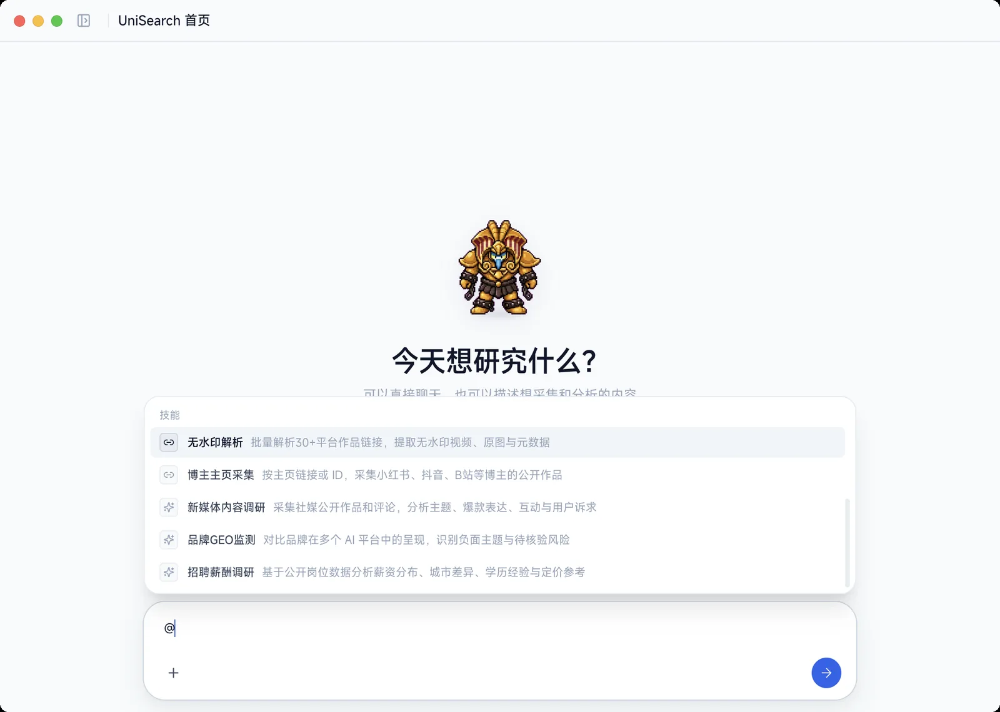
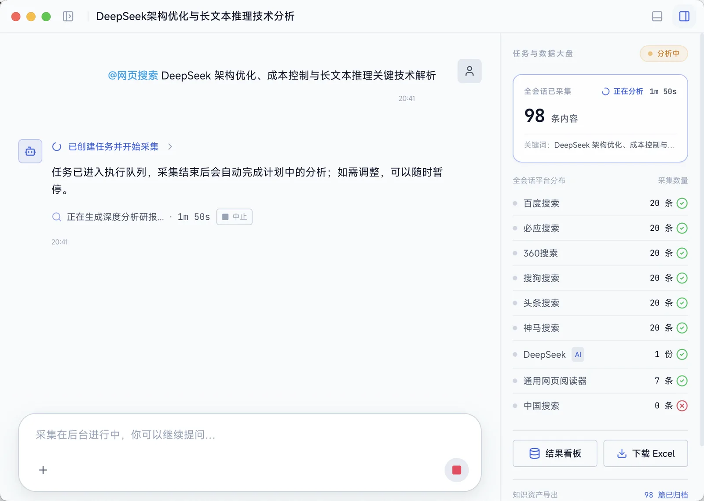
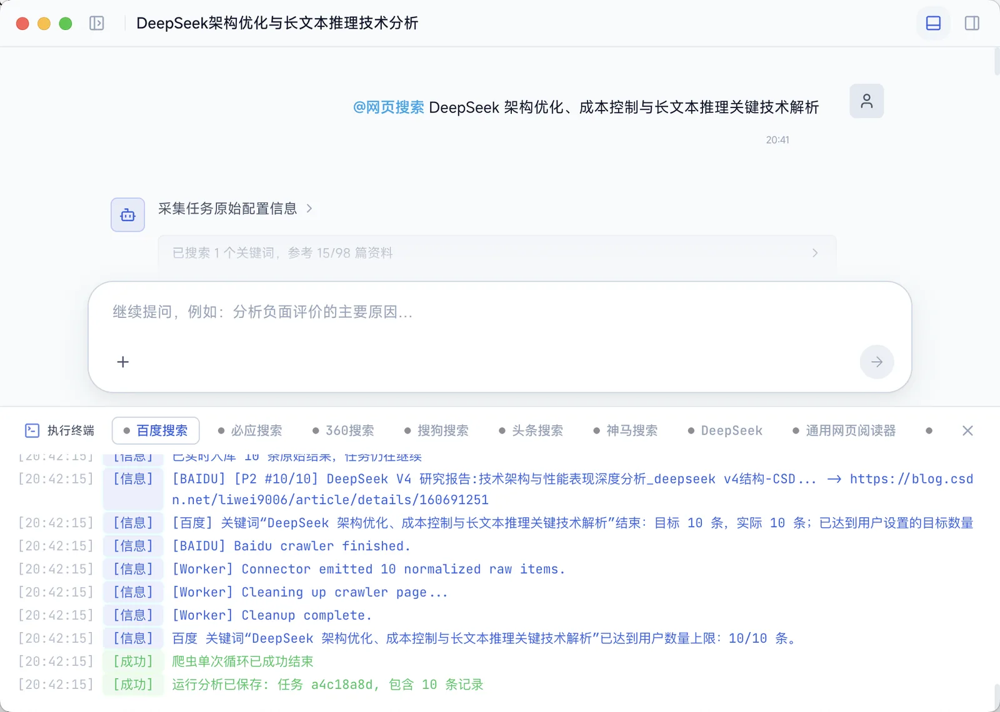
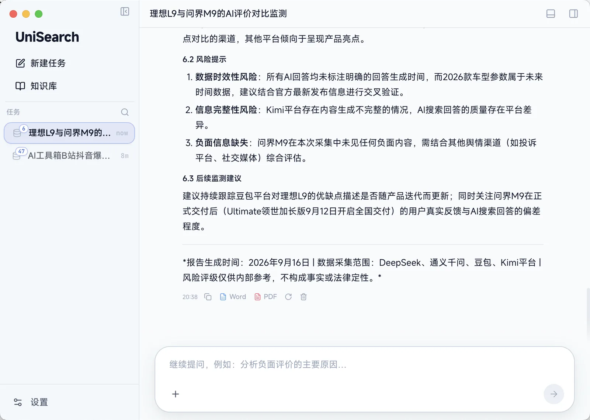
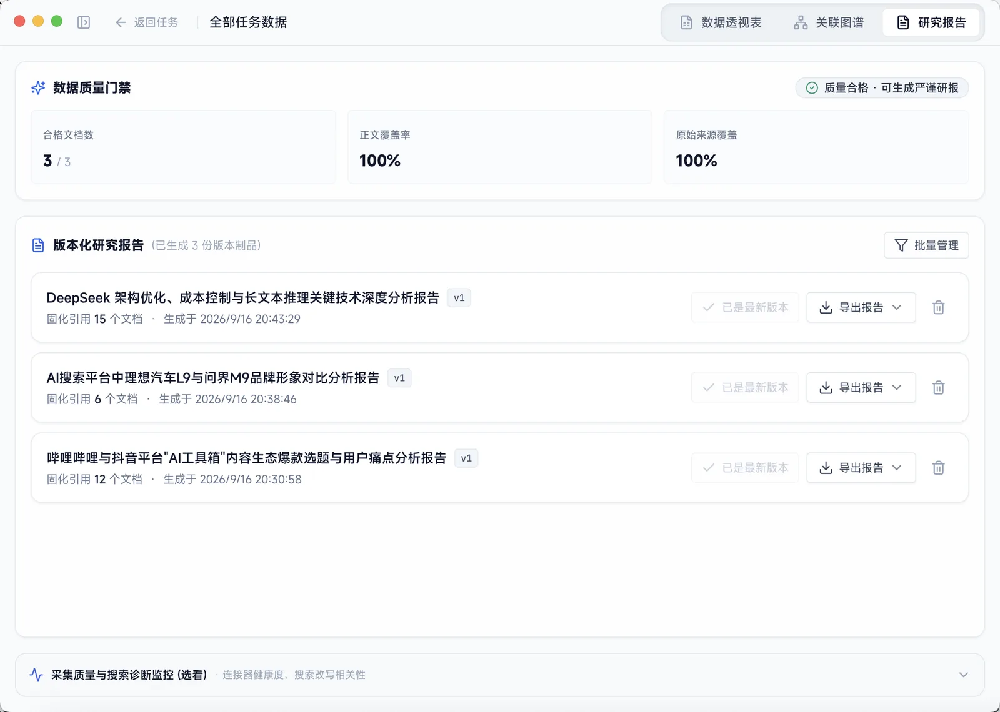
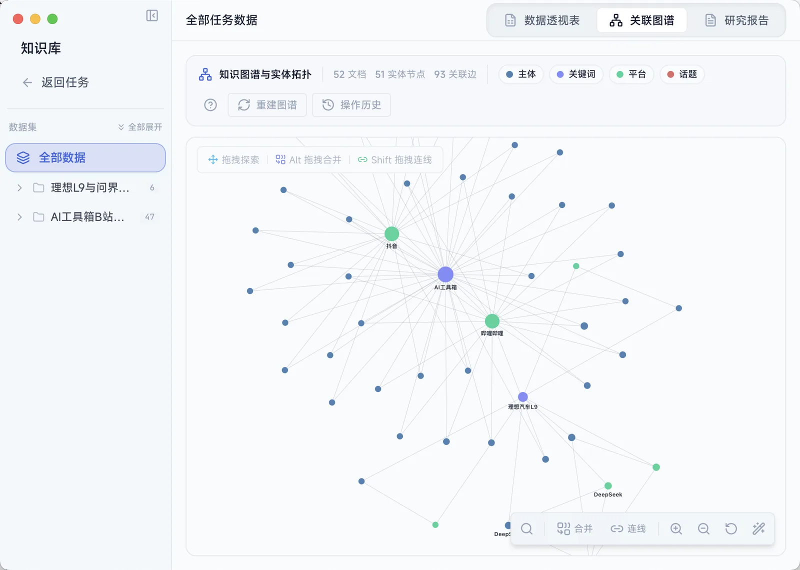
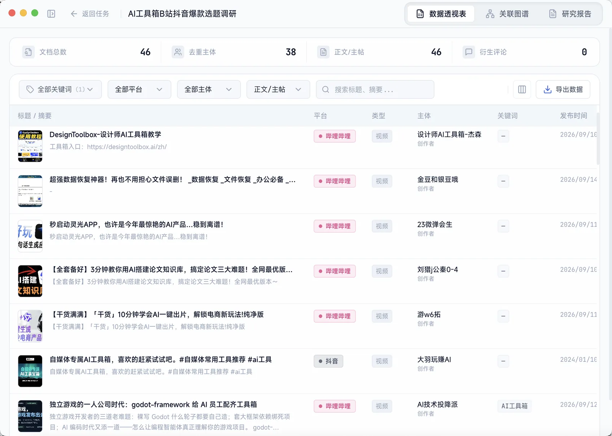
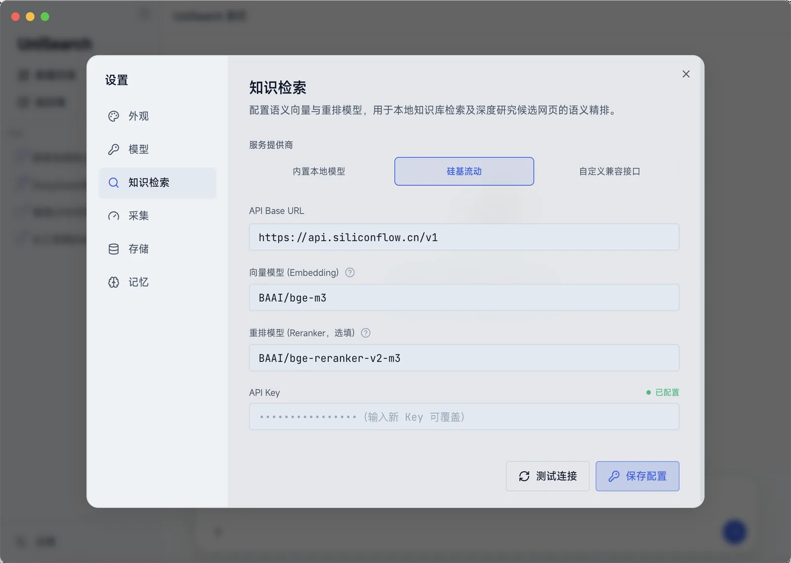

<div align="center">


# UniSearch

**一句话搞定全网调研：AI 驱动的多平台数据采集与深度研报桌面工作台**

[](LICENSE)
[](https://nodejs.org/)
[](https://www.electronjs.org/)
[](https://www.typescriptlang.org/)
[](#-为什么选择-unisearch)

<p align="center">
<a href="#-应用界面一览">界面一览</a> •
<a href="#-unisearch-能帮你做什么">核心功能</a> •
<a href="#-3-步极速上手指南">极速上手</a> •
<a href="#-32-全网信源与-13-大内置技能">支持平台</a> •
<a href="#-常见问题解答-faq">常见问题</a> •
<a href="#-联系作者与交流">联系交流</a>
</p>

UniSearch 是一款专为**内容创作者、市场运营、行业分析师与学生研究员**打造的桌面 AI 调研神器。

**无需编写任何爬虫代码**，只需在输入框里像聊天一样提出需求，AI 就会自动前往全网数十个平台抓取数据、清洗排重，并为你生成一份结构严谨、有据可查的**深度洞察研报**。

**数据与账号 100% 留存在你本地电脑；内置免费本地 AI 向量引擎，零额外费用，安全无忧。**

</div>

---

## 🖥️ 应用界面一览

UniSearch 拥有极简清爽的界面，兼具专业的数据分析大盘与可视化的知识图谱：

<table>
  <tr>
    <td width="33.3%" align="center">
      <b>🐾 极简首页与桌面伴侣</b><br>
      
    </td>
    <td width="33.3%" align="center">
      <b>🎯 13+ 场景技能（@ 快捷调度）</b><br>
      
    </td>
    <td width="33.3%" align="center">
      <b>🌐 32+ 平台并发采集大盘</b><br>
      
    </td>
  </tr>
  <tr>
    <td width="33.3%" align="center">
      <b>⚡ 底层多进程执行终端</b><br>
      
    </td>
    <td width="33.3%" align="center">
      <b>📊 AI 深度调研研报正文</b><br>
      
    </td>
    <td width="33.3%" align="center">
      <b>📑 版本化研报库与质量门禁</b><br>
      
    </td>
  </tr>
  <tr>
    <td width="33.3%" align="center">
      <b>🕸️ 交互式知识图谱</b><br>
      
    </td>
    <td width="33.3%" align="center">
      <b>📑 多维数据透视表 (下载Excel)</b><br>
      
    </td>
    <td width="33.3%" align="center">
      <b>🔒 纯本地向量与模型配置</b><br>
      
    </td>
  </tr>
</table>

---

## 💡 UniSearch 能帮你做什么？

### 1. 🤖 说人话就能做全网调研
无需繁琐配置，直接对它说：“*调研一下最近小红书和抖音上的热门 AI 办公工具选题*”，AI 就会自主拆解任务、多平台并发搜索、抓取作品和高赞评论，最后归纳出爆款标题套路、用户高频吐槽与内容机会。

### 2. 🌐 跨 32+ 平台一站式聚合
* **自媒体与社媒**：小红书、抖音、快手、B站、微博、知乎、贴吧
* **全网搜索引擎**：百度、必应、360、搜狗、今日头条、神马搜索、中国搜索
* **AI 问答对比**：DeepSeek、Kimi、豆包、通义千问、腾讯元宝、纳米AI、文心一言
* **商业与学术资讯**：36氪、arXiv 论文、GitHub 热门项目、AI HOT 热点
* **招聘求职行情**：智联招聘、前程无忧、猎聘、BOSS直聘、黑猫投诉

### 3. 📖 告别 AI 幻觉，有据可查
生成的每一份研报中的观点和数据，都会标注**原始网页引用来源与段落编号**。鼠标悬停即可查看原始文章，保证数据真实可靠。

### 4. 🔒 本地优先，隐私安全零泄露
* 你的所有搜索记录、采集数据、登录 Cookie 均**保存在你本地电脑的 SQLite 数据库中**，绝不上云。
* 内置纯本地 ONNX 向量语义检索模型，**无需充值购买向量服务**，开箱即用。

---

## 🚀 3 步极速上手指南

> 💡 **小白免配置推荐**：👉 [**前往 Releases 下载 macOS / Windows 桌面安装包**](https://github.com/ucmao/unisearch/releases)（双击即可直接安装运行，无需任何命令行操作！）
> 
> *（如果您想通过源码进行本地运行与开发调试，请跟随下方 3 步指南）*

### 第 1 步：安装前置基础环境

确保电脑上安装了 **Node.js**（推荐下载 LTS 稳定版）：
* 👉 [Node.js 官方下载页面](https://nodejs.org/)（要求版本 >= `22.12.0`）

---

### 第 2 步：下载并启动项目

打开电脑的 **终端（Mac）** 或 **命令提示符 / PowerShell（Windows）**，依次复制粘贴运行以下命令：

```bash
# 1. 下载源码到本地
git clone https://github.com/ucmao/unisearch.git
cd unisearch

# 2. 一键安装依赖（会自动下载内置的免费本地向量模型）
npm install
npm --prefix webui install

# 3. 启动应用
npm run webui:build && npm run build:backend
npm run electron:dev
```

运行后，UniSearch 桌面客户端窗口将自动弹出！

---

### 第 3 步：配置你的大模型 API

点击软件右上角的 **「设置」** 图标：
1. **填写大模型 API**：输入你常用的大模型 API Key（支持 **DeepSeek、MiniMax、OpenAI、Kimi**，或者本地运行的 **Ollama**）。
2. **知识检索**：保持默认的 **「内置本地模型」** 即可（完全免费，本地毫秒级向量语义检索）。

**🎉 大功告成！现在你可以在输入框里输入任何问题开始调研了！**

---

## 🎯 32+ 全网信源与 13 大内置技能

UniSearch 支持在输入框中输入 `@` 呼出快捷技能：

### 💼 常用业务研报技能（采集 + 自动生成深度研报）
* **`@新媒体内容调研`**：针对指定赛道或对标账号，自动分析小红书/抖音/B站的爆款选题、互动数据与评论痛点。
* **`@品牌GEO监测`**：向 DeepSeek、Kimi、豆包、通义千问等多个 AI 提问相同问题，对比大模型对品牌的回答与负面风险。
* **`@招聘薪酬调研`**：基于智联/前程无忧等招聘平台，快速测算目标岗位的市场薪资水位与技能要求。

### 🛠️ 常用数据采集技能
* **`@网页搜索`**：一次性并发搜索百度、必应、360、搜狗、头条等 7 大引擎，并自动阅读提取正文。
* **`@社媒搜索`**：跨平台聚合小红书、抖音、B站、知乎公开作品与热门讨论。
* **`@无水印解析`**：直接粘贴单条或多条短视频/图文链接，秒级提取无水印原画视频、原图与文案。
* **`@博主主页采集`**：输入博主主页链接，一键批量采集历史公开作品与互动指标。
* **`@学术搜索` / `@代码搜索`**：检索 arXiv 国际学术论文库或 GitHub 热门开源项目。

---

## ❓ 常见问题解答 (FAQ)

<details>
<summary><b>Q1: 使用 UniSearch 需要付费吗？</b></summary>
UniSearch 本身完全开源免费。软件内置的向量检索和数据处理全部在本地运行，零额外费用。你只需准备一个大模型 API Key（如 DeepSeek 或 MiniMax，费用极低；若使用本地 Ollama 则完全免费）。
</details>

<details>
<summary><b>Q2: 遇到部分平台需要登录怎么办？</b></summary>
UniSearch 内置了安全隔离的登录沙箱。点击任务或设置中的平台登录，在弹出的窗口中正常扫码登录即可。登录凭证 Cookie 仅保存在你本地电脑中，不会被上传。
</details>

<details>
<summary><b>Q3: 采集到的数据怎么导出发给同事或存入笔记？</b></summary>
在任务详情或数据透视表右上角，支持一键导出为 <b>Excel 表格 (.xlsx)</b>、<b>Word 报告 (.docx)</b>、<b>PDF</b>、<b>Markdown 文档</b> 以及 <b>Obsidian 知识库</b>。
</details>

<details>
<summary><b>Q4: 如何打包成可以直接双击安装的 .dmg (Mac) 或 .exe (Windows) 安装包？</b></summary>
详细的打包指南请参阅：<a href="docs/release-packaging.md"><b>桌面端发布与打包指南</b></a>。
</details>

---

## ⭐ 支持与 Star

如果 UniSearch 为您的工作、学习或数据调研节省了宝贵时间，欢迎在 GitHub 右上角点个 **Star 🌟** 支持一下开源项目的持续发展与更新！

---

## 📬 联系作者与交流

如果您在安装、使用或接入过程中遇到任何问题，欢迎通过以下渠道交流与反馈：

- **微信**：`csdnxr`
- **QQ**：`294323976`
- **邮箱**：[leoucmao@gmail.com](mailto:leoucmao@gmail.com)
- **Bug 报告与需求建议**：欢迎在 GitHub 提交 [Issues](https://github.com/ucmao/unisearch/issues)

---

## 📄 开源协议与免责声明

本项目遵循 [MIT License](LICENSE) 协议开源。

**免责声明：**
1. 本项目仅供个人技术研究、学术探讨与学习交流使用，严禁用于任何商业牟利、非法抓取或侵犯他人权益的场景。
2. 使用本项目时，请严格遵守所在国家/地区的法律法规及各目标平台的服务条款（ToS）与 Robots 协议。因不当使用产生的任何法律责任或纠纷，均由使用者自行承担，与本项目开发者无关。
