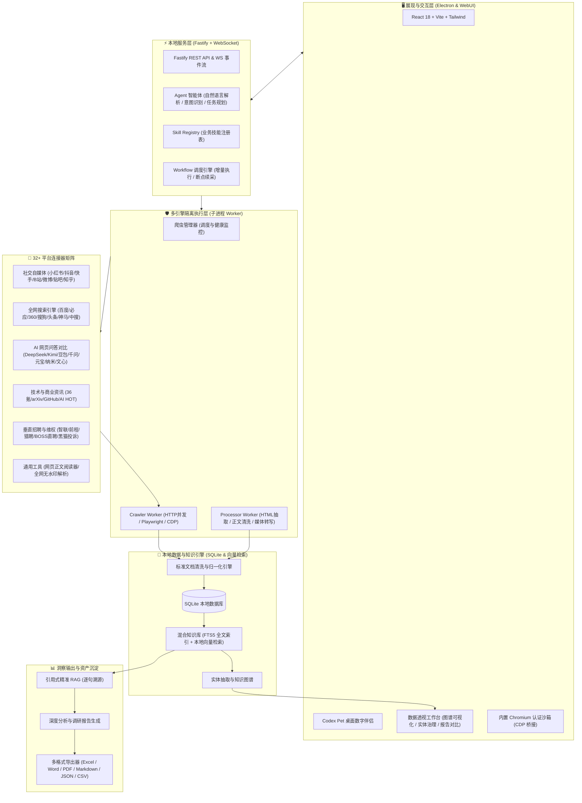

<div align="center">


# UniSearch

**现代化跨平台 AI 自主内容调研与数据采集工作台**

[](LICENSE)
[](https://nodejs.org/)
[](https://www.electronjs.org/)
[](https://www.typescriptlang.org/)
[](https://fastify.dev/)
[](https://react.dev/)
[](#-核心特性)

<p align="center">
<a href="#️-系统架构">系统架构</a> •
<a href="#-核心特性">核心特性</a> •
<a href="#-32-采集信源矩阵">采集信源矩阵</a> •
<a href="#-预置业务技能">预置业务技能</a> •
<a href="#-快速开始">快速开始</a> •
<a href="#-多平台打包与发布">打包与发布</a> •
<a href="#-项目目录结构">项目目录结构</a> •
<a href="#-联系作者与交流">联系作者</a>
</p>


UniSearch 是一款专为研究员、分析师与数据探索者打造的 **AI 驱动跨平台多信源公开内容采集与深度调研桌面工作台**。

通过自然语言提出调研诉求，AI 自主拆解意图、规划采集路径、调度连接器并发抓取、清洗归一并生成结构化洞察报告。

**数据与登录态 100% 本地留存；支持接入任意兼容主流标准的本地或云端大模型。**

</div>

---

## 🏗️ 系统架构

UniSearch 采用 **本地优先（Local-First）** 与 **子进程沙箱隔离** 架构：



### 架构亮点

- **子进程沙箱隔离**：采集与数据处理独立在 Node.js 子进程中运行，避免 UI 卡顿，单 Worker 异常自动恢复。
- **混合多引擎调度**：免认证接口走 HTTP 高并发，复杂动态页面走 Playwright，风控挑战自动无缝桥接至内置 Chromium。
- **统一标准化文档**：多源异构数据统一归一化为标准文档结构，包含标题、正文、作者、发布时间、多媒体及互动指标。
- **本地优先与隐私安全**：采集数据、知识索引与登录态 Cookie 均保存在本地 SQLite 与沙箱目录，不上传第三方服务器。

---

## ✨ 核心特性

- **🤖 AI 自主拆解与增量调度**：输入调研课题，AI 自动拆解意图、匹配连接器、拓宽关键词并规划深度；支持断点续采与增量去重。
- **🧠 本地混合 RAG & 逐句证据溯源**：融合 SQLite FTS5 全文检索与本地向量检索，所有研报结论与提取数据均精准标注原始出处段落与链接。
- **🕸️ 实体治理与知识图谱**：自动抽取公司、品牌、人物及竞品实体，支持实体一键归并、多义拆分与拓扑演化展现。
- **📊 多维数据透视与多格式导出**：按平台、时间、作者及互动指标多维筛选过滤，支持导出 Excel、Word、PDF、Markdown、JSON、CSV 等。
- **🔒 隔离沙箱与防风控认证**：内置 Chromium 沙箱扫码登录并持久化 Cookie；人机验证可视化交互；数据 100% 本地存储不上传第三方。

---

## 🌐 32+ 采集信源矩阵

内置 **32 个开箱即用的专业连接器**，覆盖全网主流公开信源：

- 📱 **社交自媒体**：小红书、抖音、快手、哔哩哔哩、微博、知乎、百度贴吧
- 🔍 **全网搜索引擎**：百度、必应、360、搜狗、头条、神马、中国搜索
- 🤖 **AI 网页问答**：DeepSeek、Kimi、豆包、通义千问、腾讯元宝、纳米 AI、文心一言
- 📰 **技术与商业资讯**：36氪、arXiv 论文、GitHub 热门、AI HOT 热点
- 💼 **招聘与维权**：智联招聘、前程无忧、猎聘、BOSS 直聘、黑猫投诉
- 🛠️ **通用解析**：通用网页正文阅读器、30+ 平台综合无水印音视频解析

👉 详细参数校验、接口覆盖与认证规范请参阅 [**32 个连接器完整矩阵文档**](docs/connectors-matrix.md)。

---

## 🎯 预置业务技能

支持用斜杠指令 (`/`) 一键调度预置高阶业务技能（Business Skills）：

- **💡 竞品情报分析** (`sales-course-intelligence`)：聚合社交与搜索信源，分析竞品定价、营销钩子与痛点对策。
- **📈 新媒体爆款调研** (`marketing-content-research`)：跨平台拆解热门选题，提炼高赞表达方式与评论关注点。
- **🛡️ 品牌 GEO 风险监测** (`brand-geo-risk-monitor`)：评估品牌在 7 大 LLM 中的可见性与一致性，识别负面风险线索。
- **💼 招聘薪酬 Benchmark** (`hr-salary-benchmark`)：测算行业薪水水位与城市差异，解析 JD 技能要求。

👉 更多自定义技能开发请参阅 [**业务技能 Manifest 规范文档**](docs/business-skills/)。


---

## 🚀 快速开始

### 📋 环境要求

- **Node.js** >= `22.12.0` ([Node.js 官方下载](https://nodejs.org/))
- **npm** >= `10.0.0`
- **操作系统**：macOS (Apple Silicon / Intel) 或 Windows 10/11 (x64)

### 📦 安装依赖

```bash
# 1. 克隆项目仓库
git clone https://github.com/ucmao/unisearch.git
cd unisearch

# 2. 安装后端与前端依赖
npm install
npm --prefix webui install
```

### 🖥️ 启动开发模式

```bash
# 构建 WebUI 前端与后端
npm run webui:build && npm run build:backend

# 启动 Electron 桌面应用
npm run electron:dev
```

> **🔑 模型配置提示**：首次进入应用后，请在「设置」中配置大模型 API 凭据（支持 MiniMax、DeepSeek、OpenAI 或任何兼容 API）。

### 🧪 测试与代码规范

```bash
# 运行 Agent 核心测试套件
npm run test:agent

# 代码质量检查
npm run lint

# 自动修复格式问题
npm run lint:fix
```

---

## 📦 多平台打包与发布

完整的本地构建、平台专属正式发布（macOS / Windows）、签名公证与安装包校验规范，请参阅：

👉 **[桌面端发布与打包指南](docs/release-packaging.md)**

---


## 📂 项目目录结构

```text
unisearch/
├── api/                   # 本地 WebUI 静态托管目录
├── build/                 # 应用图标 (icns / ico / png) 与构建资源
├── data/                  # 本地运行时 SQLite 数据库与缓存
├── docs/                  # 详细架构设计与业务技能规范文档
│   ├── architecture/      # 架构设计文档
│   └── business-skills/   # 核心业务技能设计规范
├── resources/             # 打包外置依赖与静态资源
├── scripts/               # 发布校验、环境检测与冒烟测试脚本
├── src/                   # 后端主进程与核心服务源码 (TypeScript)
│   ├── analyzers/         # 深度调研报告生成、图谱与数据分析器
│   ├── connectors/        # 32+ 平台连接器 Manifests、Registry、健康检查
│   ├── core/              # 核心配置、日志系统、类型定义与错误处理
│   ├── crawler/           # 爬虫管理器与 Crawler Worker (Playwright / HTTP / CDP)
│   ├── database/          # SQLite 数据库模型、Migrations 与 Repositories
│   ├── document/          # 标准文档引擎与清洗归一化
│   ├── exporters/         # Excel / Word / PDF / Markdown / JSON / CSV 等导出器
│   ├── knowledge/         # FTS5 全文索引、向量检索、知识图谱与 RAG 引擎
│   ├── main/              # Electron 主进程、窗口管理、托盘与 IPC 通信
│   ├── processor/         # Processor Worker 子进程数据处理流水线
│   ├── server/            # Fastify HTTP 服务、REST API 与 WebSocket 推送
│   ├── services/          # Agent 服务、工作流调度、认证与资产管理
│   ├── skills/            # 业务技能注册表与执行编排
│   ├── tools/             # AI Agent 可调用的底层工具集
│   └── workflow/          # 工作流引擎、DAG 调度器与增量执行状态机
├── tests/                 # 单元测试与 Agent 评估测试
└── webui/                 # 前端桌面 UI 源码 (React 18 + Vite + Tailwind)
    └── src/
        ├── components/
        │   ├── agent/     # 智能对话工作区、任务规划器与 Codex Pet 伴侣
        │   ├── analytics/ # 数据透视工作台、知识图谱与报告对比
        │   ├── config/    # 模型与连接器配置面板
        │   ├── console/   # 执行终端与运行日志
        │   ├── crawler/   # 采集进度与认证弹窗
        │   ├── data/      # 数据浏览与多格式导出
        │   ├── env/       # 环境检测与依赖安装
        │   └── layout/    # 顶部导航、侧边栏与设置弹窗
        ├── hooks/         # 状态与网络请求 Custom Hooks
        ├── store/         # 全局状态管理
        └── types/         # 前端 TypeScript 类型定义
```

---

## 📬 联系作者与交流

如果您在开发、使用或接入过程中遇到任何问题，欢迎通过以下渠道交流与反馈：

- **微信**：`csdnxr`
- **QQ**：`294323976`
- **邮箱**：[leoucmao@gmail.com](mailto:leoucmao@gmail.com)
- **Bug 报告与需求建议**：欢迎在 GitHub 提交 [Issues](https://github.com/ucmao/unisearch/issues)
- **官方网站**：[UniSearch Official Website](https://github.com/ucmao/unisearch)

---

## 📄 开源协议与免责声明

本项目遵循 [MIT License](LICENSE) 协议开源。

**免责声明：**
1. 本项目仅供个人技术研究、学术探讨与学习交流使用，严禁用于任何商业牟利、非法抓取或侵犯他人权益的场景。
2. 使用本项目时，请严格遵守所在国家/地区的法律法规及各目标平台的服务条款（ToS）与 Robots 协议。因不当使用产生的任何法律责任或纠纷，均由使用者自行承担，与本项目开发者无关。
